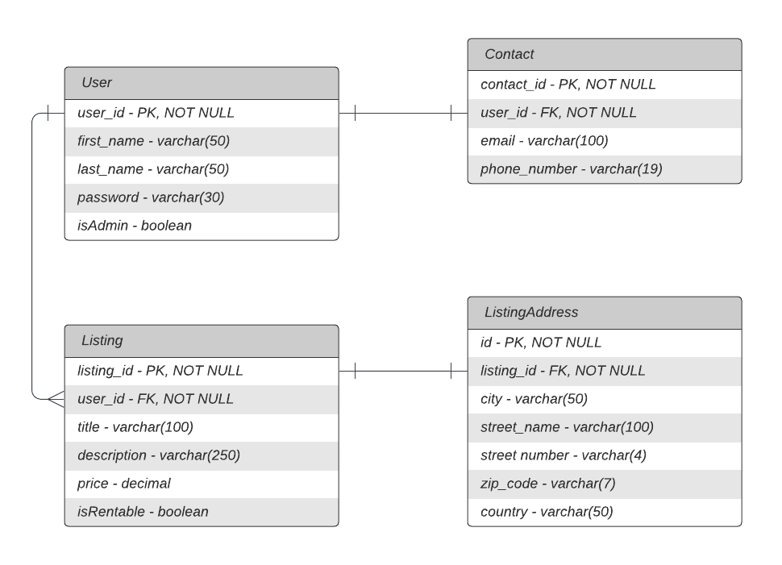

## Description

A real estate search API built with NestJS.

## Technologies used:

- NestJS
- TypeORM
- ExpressJS
- SQLite

## Entity Relationship Diagram (ERD)


## Installation

```bash
$ npm install
```

## Running the app

```bash
# development
$ npm run start

# watch mode
$ npm run start:dev

# production mode
$ npm run start:prod
```

## License

Nest is [MIT licensed](LICENSE).
# real-estate-api-nestjs
